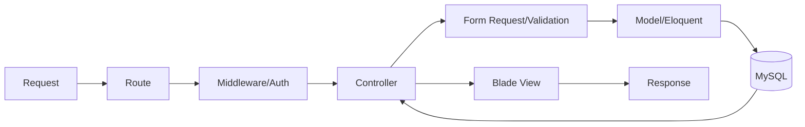
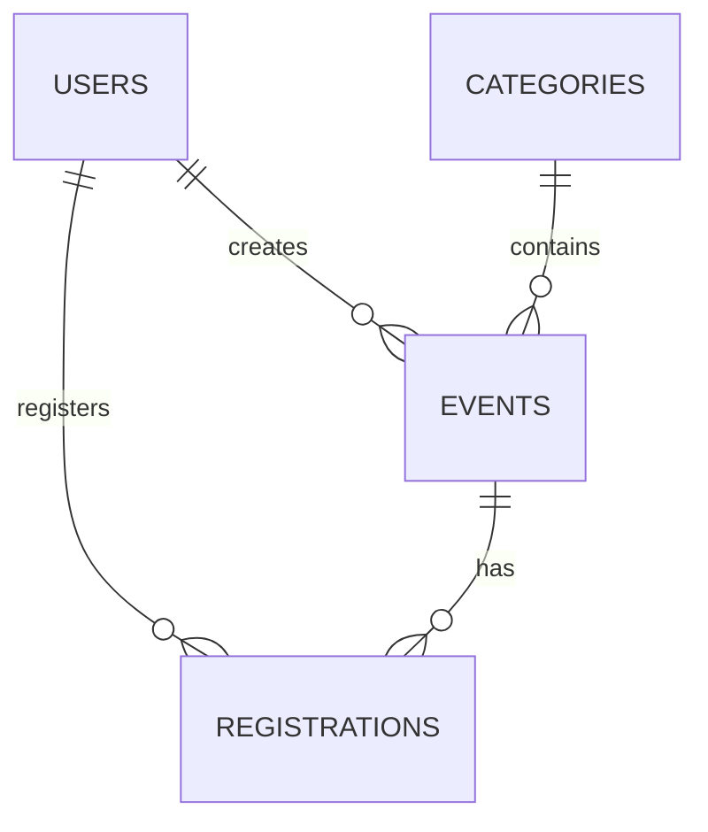

# Website Quản lý Sự kiện – Đăng ký tham gia

## 1. Tên đề tài

Website hỗ trợ tạo và công bố sự kiện, để người dùng đăng ký tham gia; admin quản lý sự kiện, chuyên mục và người tham gia. Sự kiện được phân loại theo chuyên mục.

**Trạng thái hiện tại:** Project scaffold/configuration only. Chưa triển khai nghiệp vụ; README này mô tả kế hoạch để tiếp tục phát triển theo từng Lab.

## 2. Mục tiêu đồ án

Đồ án thực hành PHP/Laravel, OOP/MVC, MySQL, Eloquent ORM, routing, Controller, Blade, migration, seeder, factory, validation, middleware, authentication/authorization, CSRF, xuất dữ liệu an toàn và tìm kiếm/phân trang. Công nghệ được giữ trong phạm vi học phần.

## 3. Phạm vi chức năng

### Public

- Xem danh sách và chi tiết sự kiện.
- Lọc theo chuyên mục, tìm kiếm theo tên và phân trang.

### User

- Đăng ký/đăng nhập.
- Đăng ký tham dự, chống đăng ký trùng.
- Xem các sự kiện đã đăng ký.
- Hủy đăng ký là phần mở rộng tùy thời gian.

### Admin

- Đăng nhập và dashboard cơ bản.
- CRUD chuyên mục, CRUD sự kiện, upload ảnh.
- Xem/quản lý người tham gia; tìm kiếm và phân trang.
- Soft delete là phần mở rộng hợp lý nếu không làm tăng độ phức tạp quá mức.

Ưu tiên hoàn thành chức năng bắt buộc trước, sau đó mới mở rộng capacity, trạng thái, upload và soft delete.

## 4. Role và ma trận quyền

| Hành động | Guest | User | Admin |
|---|---:|---:|---:|
| Xem sự kiện/chi tiết | Có | Có | Có |
| Đăng ký tham gia | Không | Có | Có |
| Xem đăng ký cá nhân | Không | Có | Có |
| Quản lý category | Không | Không | Có |
| Tạo/sửa/xóa event | Không | Không | Có |
| Xem participant | Không | Không | Có |
| Truy cập `/admin` | Không | Không | Có |

Guest chỉ xem public; User đăng ký sự kiện; Admin quản trị. Khi implementation, quyền phải được kiểm tra server-side bằng middleware/Gate/Policy, không chỉ ẩn nút Blade.

## 5. Kiến trúc MVC



- Model chứa dữ liệu và quan hệ Eloquent.
- View dùng Blade để trình bày, escape bằng `{{ }}`.
- Controller nhận request và điều phối nghiệp vụ mức ứng dụng.
- Form Request chứa validation; Middleware/Policy kiểm soát truy cập.
- Migration mô tả cấu trúc DB; Seeder/Factory cung cấp dữ liệu mẫu.
- Không sử dụng DDD, Hexagonal, Service/Repository hay kiến trúc vượt phạm vi môn học.

## 6. Mô hình dữ liệu dự kiến

Chưa tạo migration nghiệp vụ ở giai đoạn scaffold.

### `users`

| Tên cột | Kiểu dự kiến | Ý nghĩa | Ràng buộc |
|---|---|---|---|
| id | bigint | Mã người dùng | PK, Laravel mặc định |
| name | varchar | Họ tên | bắt buộc |
| email | varchar | Email | unique |
| password | varchar | Mật khẩu đã băm | bắt buộc |
| role | enum/string | `admin` hoặc `user` | mặc định `user` |

### `categories`

| Tên cột | Kiểu dự kiến | Ý nghĩa | Ràng buộc |
|---|---|---|---|
| id | bigint | Mã chuyên mục | PK |
| name | varchar | Tên chuyên mục | bắt buộc |
| description | text nullable | Mô tả | tùy chọn |
| timestamps | datetime | Thời gian | Laravel |

### `events`

| Tên cột | Kiểu dự kiến | Ý nghĩa | Ràng buộc |
|---|---|---|---|
| id | bigint | Mã sự kiện | PK |
| category_id | bigint | Chuyên mục | FK → `categories.id` |
| created_by | bigint | Admin tạo | FK → `users.id` |
| title/description | varchar/text | Nội dung | bắt buộc |
| location | varchar | Địa điểm | bắt buộc |
| start_at/end_at | datetime | Thời gian | `end_at` sau `start_at` |
| capacity | integer nullable | Sức chứa | không âm, tùy chọn |
| image_path | varchar nullable | Ảnh | tùy chọn |
| status | enum/string | `draft`, `published`, `cancelled` | mặc định phù hợp |
| timestamps | datetime | Thời gian | Laravel |

### `registrations`

| Tên cột | Kiểu dự kiến | Ý nghĩa | Ràng buộc |
|---|---|---|---|
| id | bigint | Mã đăng ký | PK |
| event_id | bigint | Sự kiện | FK → `events.id` |
| user_id | bigint | Người dùng | FK → `users.id` |
| status | enum/string | `registered`/`cancelled` | có thể tối giản |
| timestamps | datetime | Thời gian | Laravel |

Đặt `UNIQUE(event_id, user_id)` để chống đăng ký trùng. Các khóa ngoại chính là `events.category_id → categories.id`, `events.created_by → users.id`, `registrations.event_id → events.id` và `registrations.user_id → users.id`.

## 7. ERD



## 8. Quan hệ Eloquent dự kiến

- `Category hasMany Event`; `Event belongsTo Category`.
- `Event belongsTo User as creator`; `User hasMany Event as creator`.
- `User belongsToMany Event through registrations`.
- `Event belongsToMany User through registrations`.
- Có thể dùng model `Registration` riêng để quản lý `status` và quan hệ tới User/Event.

## 9. Cấu trúc thư mục

```text
app/Http/Controllers/Admin/    # controller admin, hiện là .gitkeep
app/Http/Controllers/Web/      # controller public/user
app/Http/Requests/             # Form Request theo vai trò
app/Policies/                  # policy khi cần
database/migrations/           # migration Laravel mặc định; nghiệp vụ sẽ bổ sung sau
database/factories/            # factory Laravel mặc định
database/seeders/              # seeder Laravel mặc định
resources/views/layouts/       # layout public
resources/views/partials/      # navbar/footer/flash
resources/views/events/        # view sự kiện
resources/views/my-registrations/
resources/views/admin/         # layout và view admin
public/css/ public/images/     # tài nguyên tĩnh
docs/diagrams/ screenshots/ report/
routes/web.php                 # route web; admin có thể dùng prefix trong file này
```

`.gitkeep` chỉ giữ các thư mục dự kiến trên Git khi chưa có source thật; không phải code nghiệp vụ.

## 10. Cấu hình môi trường

Yêu cầu: PHP/Composer theo Laravel 12, MySQL, Laragon hoặc `php artisan serve`, VS Code và Git. `.env.example` đã đặt local development với database `event_management`, MySQL tại `127.0.0.1:3306`, user `root` và mật khẩu trống. Không commit `.env`.

```text
git clone <GITLAB_REPOSITORY_URL>
cd project
composer install
copy .env.example .env
php artisan key:generate
# tạo database event_management và kiểm tra DB_* trong .env
php artisan migrate                 # chỉ sau khi có migration nghiệp vụ
php artisan db:seed                  # chỉ sau khi có seeder
php artisan storage:link             # sau khi có upload ảnh
php artisan serve
```

`<GITLAB_REPOSITORY_URL>` là placeholder, không phải URL giả.

## 11. Các file cấu hình chính

| File | Vai trò | Quy tắc dự án |
|---|---|---|
| `.env` | Cấu hình máy local | không commit |
| `.env.example` | Mẫu cấu hình | không chứa secret |
| `.gitignore` | Loại file runtime/secret | không ignore source cần chấm |
| `composer.json` | Dependency/scripts | giữ ràng buộc Laravel 12 |
| `composer.lock` | Khóa dependency | commit để đồng nhất môi trường |
| `package.json`/`vite.config.js` | tài sản frontend | giữ skeleton |
| `phpunit.xml` | cấu hình test | giữ skeleton |
| `config/app.php`/`config/database.php` | cấu hình framework/DB | lấy giá trị từ env |
| `bootstrap/app.php` | bootstrap và middleware Laravel 12 | cấu hình khi cần |
| `routes/web.php` | route web/user/admin | giữ đơn giản theo Lab |

## 12. Kế hoạch Authentication & Authorization

Authentication có thể dùng Laravel Breeze ở milestone implementation; chưa cài ở scaffold này. User có `role=admin|user`. `/admin/*` sẽ dùng `auth` và kiểm tra admin; Policy/Gate dùng khi cần. `@can` chỉ hỗ trợ UI, kiểm tra server-side vẫn bắt buộc.

## 13. Validation và bảo mật

- Dùng `@csrf`, `@method` cho form tương ứng.
- Dùng Form Request cho create/update.
- Validate `unique`, `exists`, ngày giờ, `after_or_equal` và dữ liệu upload MIME/size.
- Dùng `{{ }}` để escape; không nối raw SQL từ input.
- Dùng Eloquent/Query Builder/prepared statement.
- Không commit `.env`, token, password hay private key.
- Production đặt `APP_DEBUG=false`; mật khẩu do cơ chế auth Laravel hash.

## 14. Quy tắc nghiệp vụ quan trọng

`end_at` phải sau `start_at`; chỉ event `published` hiển thị public; user không đăng ký trùng; nếu có capacity thì không vượt số chỗ; event `cancelled` không nhận đăng ký mới; chỉ admin CRUD category/event; mọi dữ liệu form phải validate server-side. Capacity/status có thể giản lược nếu scope tối thiểu được yêu cầu.

## 15. Giao diện dự kiến

Dùng Blade layout, partial navbar/footer, component alert/input/button khi phù hợp; admin có layout riêng. Bootstrap 5 CDN là lựa chọn ưu tiên cho responsive desktop/mobile và giảm cấu hình build. Các trang dự kiến: public home/list/detail; user my registrations; admin dashboard/categories/events/registrations. Chưa tạo UI thật.

## 16. Roadmap

| Milestone | Output chính |
|---|---|
| M0 Scaffold/config | Laravel skeleton, env mẫu, placeholder, README |
| M1 Database + Eloquent | migration, model, quan hệ, factory/seeder |
| M2 Public pages | danh sách, chi tiết, lọc, tìm kiếm, phân trang |
| M3 Authentication + roles | đăng ký/đăng nhập, auth, admin role |
| M4 User registration | đăng ký sự kiện, chống trùng, danh sách cá nhân |
| M5 Admin | CRUD category/event, participant |
| M6 Hoàn thiện | upload, validation, UI responsive, mở rộng |
| M7 Kiểm thử/báo cáo | test, screenshot, report, deployment |

## 17. Mapping với nội dung Lab

| Nội dung đồ án | Kiến thức áp dụng |
|---|---|
| Laravel skeleton/MVC | framework, OOP, routing/controller |
| Blade layout/partials/components | view và tái sử dụng giao diện |
| Migration/Seeder/Factory/Eloquent | DB, ORM, quan hệ |
| Form Request | validation |
| Middleware/Auth/Authorization | bảo vệ tài nguyên |
| Search/pagination | truy vấn và hiển thị dữ liệu |
| Upload ảnh | xử lý file an toàn |
| Admin area | phân quyền và resource route |

## 18. Mapping rubric

| Tiêu chí | Trọng số | Cách dự án đáp ứng | Minh chứng dự kiến |
|---|---:|---|---|
| Hình thức báo cáo | 10% | README/report rõ, đúng chính tả | docs/report, screenshot |
| Nội dung/chất lượng báo cáo | 10% | bài toán, use case, ERD, DB, kiến trúc, test, setup | README/report |
| Giao diện phần mềm | 30% | layout thống nhất, responsive, public/admin rõ | screenshots, bản chạy |
| Sản phẩm phần mềm | 40% | core functions, MVC/Eloquent, role, validation, CRUD, search/pagination | source, test |
| Tham gia nhóm | 10% | commit theo thành viên, task và phân công | Git history, bảng nhóm |

Mục tiêu là hướng tới mức 10–8.5 theo rubric, không cam kết điểm tuyệt đối.

## 19. Quy ước Git/GitLab

`main` là nhánh ổn định; dùng `feature/<ten-chuc-nang>` cho chức năng. Commit nhỏ, rõ ràng, ví dụ: `chore: initialize Laravel project scaffold`, `feat: add event catalog`, `feat: add event registration`, `feat: add admin event management`, `fix: prevent duplicate registrations`, `docs: update project report`. Không cần GitFlow phức tạp.

## 20. Phân công nhóm

| Thành viên | MSSV | Nhiệm vụ | Nhánh chính | Minh chứng |
|---|---|---|---|---|
| _(nhóm tự điền)_ |  |  |  |  |
| _(nhóm tự điền)_ |  |  |  |  |

## 21. Test checklist dự kiến

- [ ] Guest truy cập các trang public.
- [ ] User auth và đăng ký sự kiện.
- [ ] Admin authorization và CRUD category/event.
- [ ] Validation, chống đăng ký trùng và capacity.
- [ ] Search, pagination, upload.
- [ ] Truy cập trái phép trả redirect/403.
- [ ] Kiểm tra responsive thủ công.

## 22. Deployment checklist

Đặt `APP_ENV=production`, `APP_DEBUG=false`, cấu hình `.env` server; chạy `composer install --optimize-autoloader --no-dev`; dùng `migrate --force` khi triển khai; chạy `storage:link`; cache config/route/view khi phù hợp; document root trỏ vào `public/`; dùng HTTPS nếu có; không commit `.env`. Chỉ mô tả, chưa deploy ở giai đoạn scaffold.

## 23. Trạng thái dự án

- [x] Laravel skeleton
- [x] Project configuration
- [x] Directory placeholders
- [x] Architecture/database plan
- [ ] Business migrations/models
- [ ] Authentication
- [ ] Public UI
- [ ] Registration
- [ ] Admin
- [ ] Tests
- [ ] Deployment

## 24. Tài liệu minh chứng

- `docs/diagrams/`: ERD, flow và sơ đồ kiến trúc.
- `docs/screenshots/`: ảnh minh chứng giao diện và kiểm thử.
- `docs/report/`: báo cáo môn học và tài liệu triển khai.

Các thư mục hiện chỉ có `.gitkeep`. README không khai báo thành viên, URL hay chức năng đã hoàn thành khi mới scaffold.
