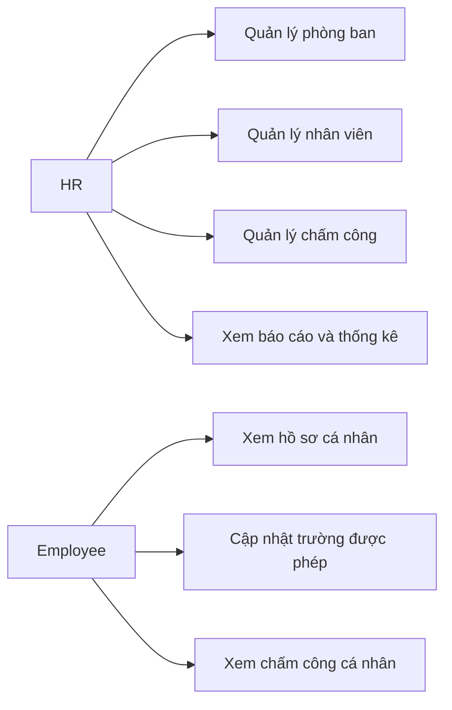
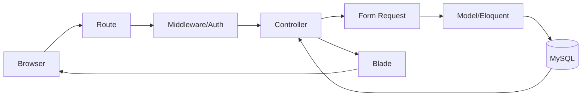
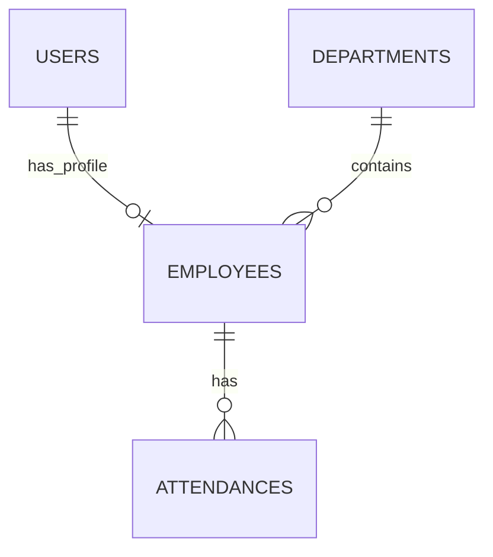

# Website Quản lý Nhân sự

## Trạng thái dự án

Đây là scaffold/configuration của đồ án môn **Lập trình mã nguồn mở** với Laravel 12. Hiện chưa triển khai chức năng nghiệp vụ. Các thư mục nghiệp vụ mới chỉ có `.gitkeep` để giữ cấu trúc trên Git.

## 1. Tên đề tài

Website quản lý thông tin nhân viên, phòng ban, chấm công và báo cáo/thống kê nhân sự. Hệ thống dự kiến có hai vai trò: **HR** quản lý hệ thống và **Employee** xem, cập nhật phần hồ sơ được phép và xem chấm công của chính mình.

## 2. Mục tiêu đồ án

Đồ án áp dụng PHP, OOP, Laravel 12, MVC, MySQL, Blade, Eloquent ORM, Migration, Seeder/Factory, Resource Controller, named route, Form Request/Validation, Middleware, Authentication/Authorization, CSRF, Blade escaping, tìm kiếm, phân trang và truy vấn thống kê `COUNT`/`GROUP BY`. Git được dùng để quản lý lịch sử đóng góp nhóm.

Giải pháp giữ trong phạm vi học phần: không dùng DDD, Hexagonal, Clean Architecture nhiều tầng, Repository/Service abstraction, microservice, Redis, queue, SPA framework, API-only architecture hoặc package xuất Excel/PDF ở giai đoạn scaffold.

## 3. Phạm vi chức năng dự kiến

### HR

- Đăng nhập và dashboard thống kê cơ bản.
- CRUD phòng ban, CRUD nhân viên và gán nhân viên vào phòng ban.
- Quản lý/chỉnh sửa bản ghi chấm công.
- Tìm kiếm, lọc và phân trang nhân viên/chấm công.
- Xem báo cáo chấm công và thống kê nhân sự theo phòng ban/trạng thái.
- Xuất CSV và trang HTML thân thiện với thao tác in.

### Employee

- Đăng nhập và xem hồ sơ của chính mình.
- Cập nhật các trường cá nhân được cho phép.
- Xem lịch sử chấm công của chính mình và lọc theo tháng.
- Không được tự thay đổi role, mã nhân viên, phòng ban, chức vụ, ngày vào làm hoặc trạng thái làm việc.

### Ngoài phạm vi bản cơ bản

Payroll/tính lương, tuyển dụng, KPI, nghỉ phép phức tạp, ca làm việc nhiều tầng, fingerprint, QR, GPS và self check-in không thuộc core scope. Excel/PDF bằng package chỉ là mở rộng khi giảng viên yêu cầu; CSV và print-friendly HTML là lựa chọn mặc định.

## 4. Role matrix

| Chức năng | HR | Employee |
|---|---:|---:|
| Đăng nhập | Có | Có |
| Xem hồ sơ bản thân | Có | Có |
| Cập nhật thông tin cá nhân được phép | Có | Có |
| Xem chấm công bản thân | Có | Có |
| Xem toàn bộ nhân viên | Có | Không |
| Tạo nhân viên | Có | Không |
| Sửa thông tin nghiệp vụ nhân viên | Có | Không |
| Xóa/vô hiệu hóa nhân viên | Có | Không |
| Quản lý phòng ban | Có | Không |
| Quản lý chấm công | Có | Không |
| Xem báo cáo toàn hệ thống | Có | Không |
| Xuất báo cáo | Có | Không |
| Truy cập `/hr` | Có | Không |

HR có quyền quản trị; Employee chỉ được truy cập dữ liệu của chính mình. Phân quyền và ownership phải kiểm tra server-side bằng middleware/policy, không chỉ ẩn nút trên Blade.

## 5. Use case tổng quát



## 6. Kiến trúc MVC



- Route định tuyến request; Middleware xác thực và giới hạn nhóm HR/Employee.
- Controller điều phối use case, không chứa validation dài.
- Form Request chứa validation khi bước implementation bắt đầu.
- Model mô tả dữ liệu và quan hệ Eloquent; Blade chỉ trình bày và escape output bằng `{{ }}`.
- Migration mô tả schema; Seeder/Factory tạo dữ liệu mẫu; Policy/Gate dùng cho ownership khi cần.
- Không dùng DDD, Hexagonal hay kiến trúc nhiều tầng vượt phạm vi môn học.

## 7. Mô hình dữ liệu dự kiến

Chưa tạo migration nghiệp vụ trong giai đoạn scaffold. Bảng `reports` không cần ở phiên bản cơ bản; báo cáo được sinh từ `employees`, `departments` và `attendances`.

### `users`

| Cột | Kiểu dự kiến | Null | Ràng buộc | Ý nghĩa |
|---|---|---|---|---|
| id | bigint | Không | PK | Mã tài khoản |
| name | string | Không | bắt buộc | Tên hiển thị |
| email | string | Không | unique | Email đăng nhập |
| password | string | Không | hash, không plain text | Mật khẩu |
| role | string/enum | Không | `hr` hoặc `employee` | Vai trò |
| timestamps | datetime | Không | Laravel | Thời gian |

### `departments`

| Cột | Kiểu dự kiến | Null | Ràng buộc | Ý nghĩa |
|---|---|---|---|---|
| id | bigint | Không | PK | Mã phòng ban |
| code | string | Không | unique | Mã phòng ban |
| name | string | Không | bắt buộc | Tên phòng ban |
| description | text | Có | tùy chọn | Mô tả |
| timestamps | datetime | Không | Laravel | Thời gian |

### `employees`

| Cột | Kiểu dự kiến | Null | Ràng buộc | Ý nghĩa |
|---|---|---|---|---|
| id | bigint | Không | PK | Mã hồ sơ |
| user_id | bigint | Không | FK `users.id`, unique | Tài khoản gắn với hồ sơ |
| department_id | bigint | Không | FK `departments.id` | Phòng ban |
| employee_code | string | Không | unique | Mã nhân viên |
| phone/address | string/text | Có | tùy chọn | Thông tin liên hệ |
| date_of_birth | date | Có | ngày hợp lệ | Ngày sinh |
| position | string | Có | tùy chọn | Chức vụ |
| hire_date | date | Không | ngày hợp lệ | Ngày vào làm |
| employment_status | string/enum | Không | `active`/`inactive` | Trạng thái làm việc |
| timestamps | datetime | Không | Laravel | Thời gian |

### `attendances`

| Cột | Kiểu dự kiến | Null | Ràng buộc | Ý nghĩa |
|---|---|---|---|---|
| id | bigint | Không | PK | Mã chấm công |
| employee_id | bigint | Không | FK `employees.id` | Nhân viên |
| work_date | date | Không | kết hợp unique | Ngày làm việc |
| check_in/check_out | time | Có | check-out >= check-in | Giờ vào/ra |
| status | string/enum | Không | present/late/absent/leave | Trạng thái |
| note | text | Có | tùy chọn | Ghi chú |
| timestamps | datetime | Không | Laravel | Thời gian |

Ràng buộc quan trọng: `employees.user_id` là unique FK tới `users`; `employees.department_id` là FK tới `departments`; `attendances.employee_id` là FK tới `employees`; `UNIQUE(employee_id, work_date)` chống trùng chấm công trong cùng ngày.

## 8. ERD



Một User có tối đa một hồ sơ Employee. Một Department có nhiều Employee. Một Employee có nhiều Attendance, mỗi ngày tối đa một bản ghi.

## 9. Quan hệ Eloquent dự kiến

- `User hasOne Employee`; `Employee belongsTo User`.
- `Department hasMany Employee`; `Employee belongsTo Department`.
- `Employee hasMany Attendance`; `Attendance belongsTo Employee`.

## 10. Quy tắc nghiệp vụ

1. Một tài khoản Employee chỉ gắn với tối đa một hồ sơ.
2. `employee_code` và `department.code` là duy nhất.
3. Một nhân viên chỉ có một attendance trong một ngày.
4. `check_out` nếu có phải lớn hơn hoặc bằng `check_in`.
5. Employee chỉ xem hồ sơ và chấm công của chính mình.
6. Employee không sửa role, mã nhân viên, phòng ban, chức vụ, ngày vào làm hoặc trạng thái.
7. HR quản lý phòng ban, nhân viên, chấm công và báo cáo.
8. Không xóa phòng ban đang có nhân viên nếu chưa chuyển nhân viên.
9. Route HR dùng `auth` và kiểm tra role `hr`.
10. Báo cáo theo tháng phải lọc đúng mốc ngày; thống kê không được đếm trùng do JOIN.

## 11. Báo cáo và thống kê dự kiến

- Báo cáo chấm công lọc theo tháng/năm, phòng ban và trạng thái; bảng gồm mã nhân viên, họ tên, phòng ban, ngày, check-in, check-out, trạng thái và ghi chú.
- Thống kê tháng gồm số ngày `present`, `late`, `absent`, `leave`.
- Thống kê nhân sự gồm tổng nhân viên, active/inactive và số nhân viên theo phòng ban, dùng `COUNT`, `GROUP BY`, `WHERE`, `ORDER BY`.
- Xuất CSV bằng `StreamedResponse`/`response()->streamDownload()` của Laravel/PHP, không cần package ngoài; có thể thêm UTF-8 BOM để Excel đọc tiếng Việt.
- Trang HTML print-friendly dùng `@media print`, cho phép Print/Save as PDF từ trình duyệt.

Đây là kế hoạch, chưa có code báo cáo hay thống kê trong scaffold.

## 12. Cấu trúc thư mục

```text
app/Http/Controllers/HR/          # .gitkeep, controller HR sẽ bổ sung sau
app/Http/Controllers/Employee/    # controller Employee sẽ bổ sung sau
app/Http/Requests/HR/             # Form Request HR
app/Http/Requests/Employee/       # Form Request Employee
app/Policies/                     # policy khi cần
database/migrations/              # migration Laravel mặc định; chưa có nghiệp vụ
database/factories/               # factory Laravel mặc định
database/seeders/                 # seeder Laravel mặc định
resources/views/layouts/          # layout chung
resources/views/partials/         # partial chung
resources/views/components/       # component chung
resources/views/hr/                # view HR dự kiến
resources/views/employee/         # view Employee dự kiến
public/css/ public/images/        # tài nguyên tĩnh
docs/diagrams/                    # ERD/use case/architecture
docs/screenshots/                 # ảnh minh chứng
docs/report/                      # báo cáo
routes/web.php                    # route web; nghiệp vụ sẽ bổ sung sau
```

`.gitkeep` chỉ giữ thư mục rỗng trên Git, không phải class hay chức năng giả.

## 13. Cấu hình môi trường

Yêu cầu: PHP và Composer theo Laravel 12, MySQL/MariaDB, Laragon hoặc `php artisan serve`, VS Code và Git.

```text
git clone <GITLAB_REPOSITORY_URL>
cd <PROJECT_FOLDER>
composer install
copy .env.example .env       # PowerShell/Windows
php artisan key:generate
# tạo database hr_management và cấu hình DB_* trong .env
php artisan migrate           # chỉ sau khi có migration nghiệp vụ
php artisan db:seed           # chỉ sau khi có seeder nghiệp vụ
php artisan serve
```

`<GITLAB_REPOSITORY_URL>` chỉ là placeholder theo tài liệu môn học, không phải URL được bịa. `.env` không commit.

## 14. Các file cấu hình chính

| File | Vai trò | Quy tắc |
|---|---|---|
| `.env` | cấu hình local | không commit |
| `.env.example` | mẫu cấu hình | không có secret, DB `hr_management` |
| `.gitignore` | loại secret/runtime | không ignore source cần chấm |
| `composer.json` | dependency Laravel | giữ Laravel 12 |
| `composer.lock` | khóa dependency | commit để đồng nhất |
| `package.json` | script frontend | giữ skeleton |
| `vite.config.js` | cấu hình Vite | giữ skeleton |
| `phpunit.xml` | cấu hình test | giữ skeleton |
| `bootstrap/app.php` | bootstrap/middleware Laravel 12 | cấu hình alias khi triển khai role |
| `config/app.php` | cấu hình ứng dụng | đọc biến môi trường phù hợp |
| `config/database.php` | kết nối DB | lấy từ `DB_*` trong env |
| `routes/web.php` | route web | có thể chứa group HR/Employee đơn giản |

## 15. Authentication và Authorization

Laravel Breeze có thể được cài theo Lab khi bắt đầu milestone authentication, nhưng chưa cài trong scaffold. `users.role` dự kiến là `hr|employee`. Nhóm `/hr/*` yêu cầu `auth` và role `hr`; nhóm `/employee/*` yêu cầu `auth` và kiểm tra ownership. Việc ẩn menu không thay thế kiểm tra server-side.

## 16. Validation và bảo mật

- Dùng `@csrf` và `@method` trong form.
- Dùng Form Request cho create/update.
- Validate FK `exists`, mã phòng ban/mã nhân viên `unique`, ngày giờ và trạng thái.
- Đảm bảo `check_out >= check_in` và unique attendance theo ngày ở cả validation lẫn database.
- Escape Blade bằng `{{ }}`, không nối raw SQL từ input.
- Dùng Eloquent/Query Builder và prepared statement.
- Hash mật khẩu qua cơ chế authentication Laravel.
- Không commit `.env`, token, password thật, private key hoặc DB dump.
- Production đặt `APP_DEBUG=false`.

## 17. Giao diện dự kiến

HR: login, dashboard, danh sách/thêm/sửa/xem nhân viên, phòng ban, chấm công và báo cáo. Employee: dashboard, hồ sơ cá nhân, sửa hồ sơ và lịch sử chấm công. Giao diện dùng Blade layout, partial, component, flash message, validation error, pagination, filter và responsive. Bootstrap 5 CDN có thể dùng để giảm cấu hình frontend. Chưa tạo UI thật ở giai đoạn này.

## 18. Roadmap

| Milestone | Kết quả chính |
|---|---|
| M0 | Scaffold, config, README, placeholders |
| M1 | Database, model, migration, quan hệ, seed |
| M2 | Authentication và role HR/Employee |
| M3 | HR quản lý phòng ban |
| M4 | HR quản lý nhân viên, Employee profile |
| M5 | Chấm công và lịch sử cá nhân |
| M6 | Báo cáo, thống kê, CSV, print, search/pagination |
| M7 | UI, test, report, screenshot, deployment |

## 19. Mapping với nội dung Lab

| Nội dung đồ án | Kiến thức áp dụng |
|---|---|
| Laravel skeleton/MVC | framework, OOP, cấu trúc MVC |
| Routing/resource Controller | route, named route, điều phối request |
| Blade layout/partial/component | view và tái sử dụng giao diện |
| Migration/Seeder/Factory | schema và dữ liệu mẫu |
| Eloquent relationships | ORM và quan hệ bảng |
| Form Request | validation |
| Middleware/Auth/Authorization | bảo vệ khu vực HR/Employee |
| Search/pagination | truy vấn và trình bày dữ liệu |
| `COUNT`/`GROUP BY` | báo cáo và thống kê |
| Admin-style management area | quản lý phòng ban, nhân viên, chấm công |
| Deployment | env, public document root, cache |

## 20. Mapping rubric

| Tiêu chí | Trọng số | Cách dự án hướng tới 10–8.5 | Minh chứng |
|---|---:|---|---|
| Hình thức báo cáo | 10% | README/report rõ, chuẩn, có ảnh | `docs/report`, screenshots |
| Nội dung/chất lượng báo cáo | 10% | bài toán, use case, ERD, DB, kiến trúc, test | README/report |
| Giao diện phần mềm | 30% | HR/Employee thống nhất, responsive, dễ dùng | bản chạy, screenshots |
| Sản phẩm phần mềm | 40% | CRUD, role, ownership, chấm công, báo cáo, CSV, search/pagination, validation | source và test |
| Tham gia thực hiện/tương tác nhóm | 10% | commit, phân công, issue/task | Git history, bảng nhóm |

Mục tiêu là hướng tới mức 10–8.5 theo rubric, không tuyên bố chắc chắn điểm 10.

## 21. Git/GitLab

Dùng `main` cho bản ổn định và `feature/<feature-name>` cho chức năng. Ví dụ commit:

```text
chore: initialize HR management project scaffold
feat: add department management
feat: add employee management
feat: add attendance management
feat: add employee self profile
feat: add HR reports and statistics
fix: restrict employee profile updates
docs: update project report
```

Không cần GitFlow phức tạp.

## 22. Phân công nhóm

| Thành viên | MSSV | Nhiệm vụ | Branch | Minh chứng |
|---|---|---|---|---|
| _(nhóm tự điền)_ |  |  |  |  |
| _(nhóm tự điền)_ |  |  |  |  |

## 23. Test checklist dự kiến

- [ ] Người chưa đăng nhập không vào được trang bảo vệ.
- [ ] HR truy cập được `/hr`; Employee bị chặn khỏi khu vực HR.
- [ ] Employee không xem được hồ sơ người khác.
- [ ] Employee không sửa được các field nghiệp vụ bị khóa.
- [ ] CRUD phòng ban/nhân viên và unique employee code.
- [ ] Không xóa phòng ban đang có nhân viên.
- [ ] Chấm công và chống trùng cùng nhân viên/ngày.
- [ ] Từ chối check-out sớm hơn check-in.
- [ ] Lọc chấm công, ownership, thống kê và CSV đúng bộ lọc.
- [ ] Phân trang giữ filter và kiểm tra responsive thủ công.

## 24. Deployment checklist

Đặt `APP_ENV=production`, `APP_DEBUG=false`, cấu hình `.env` production; chạy `composer install --optimize-autoloader --no-dev`; chạy `php artisan migrate --force` khi deploy; cache config/routes/views nếu phù hợp; document root trỏ vào `public/`; dùng HTTPS nếu server hỗ trợ; không commit `.env`. Đây chỉ là checklist, chưa deploy ở giai đoạn scaffold.

## 25. Project status

- [x] Laravel skeleton
- [x] Configuration
- [x] Placeholder directories
- [x] README architecture/database plan
- [ ] Business migrations
- [ ] Business models
- [ ] Authentication
- [ ] Roles
- [ ] Department management
- [ ] Employee management
- [ ] Attendance
- [ ] Employee profile
- [ ] Reports/statistics
- [ ] CSV export
- [ ] Tests
- [ ] Deployment

## 26. Tài liệu minh chứng

- `docs/diagrams/`: ERD, use case và architecture.
- `docs/screenshots/`: ảnh minh chứng chức năng.
- `docs/report/`: báo cáo và bản nháp.

Các thư mục hiện chỉ có `.gitkeep`. README không bịa thành viên, URL GitLab hay chức năng đã hoàn thành.
