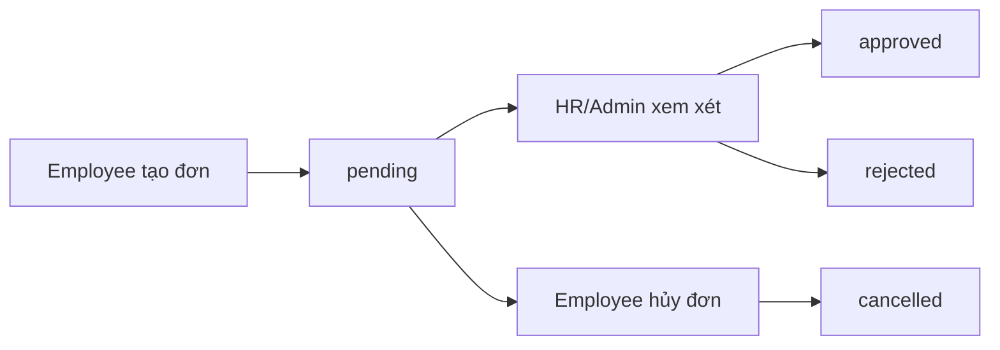

# Luồng xử lý đơn nghỉ

```mermaid
flowchart LR
    A[Employee tạo đơn] --> B[pending]
    B --> C[HR/Admin xem xét]
    C --> D[approved]
    C --> E[rejected]
    B --> F[Employee hủy đơn]
    F --> G[cancelled]
```

Leave Request độc lập với Attendance và không tự động tạo, sửa hoặc xóa bản ghi chấm công.
